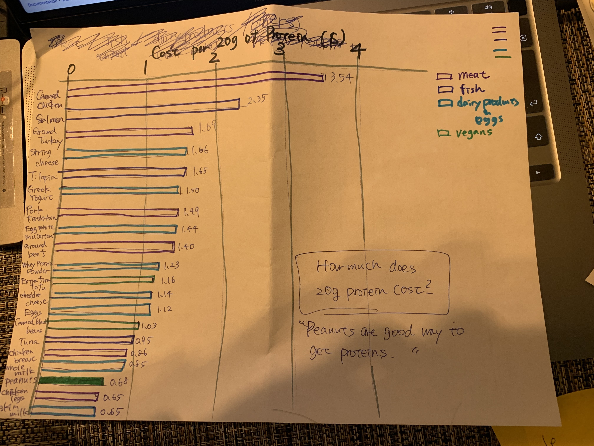
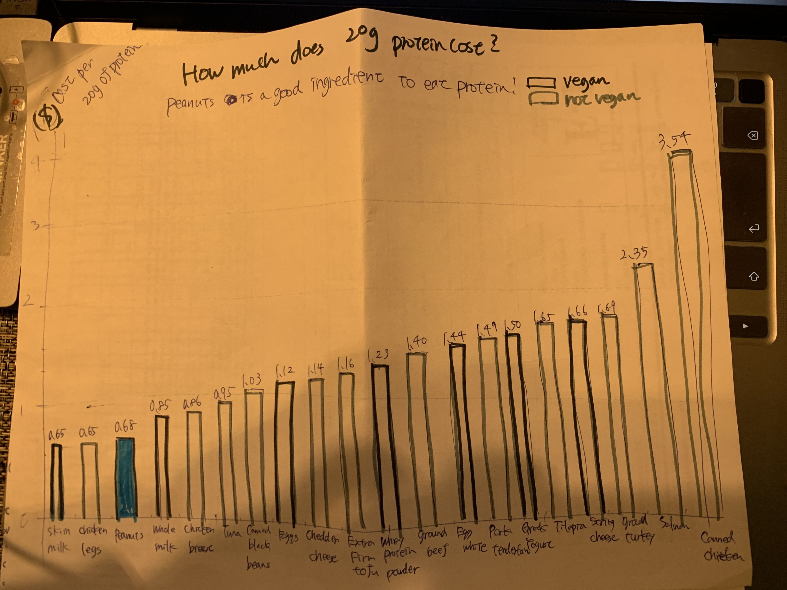
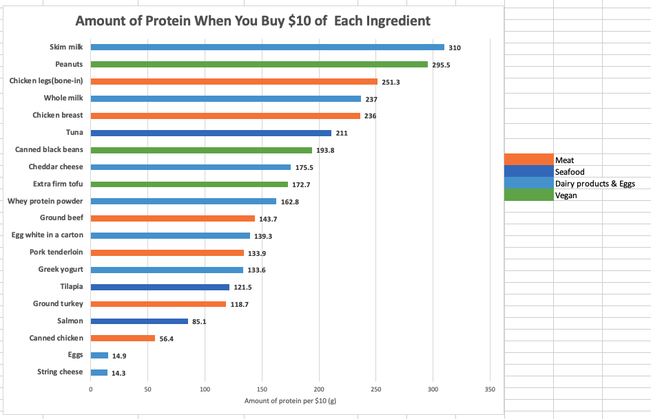
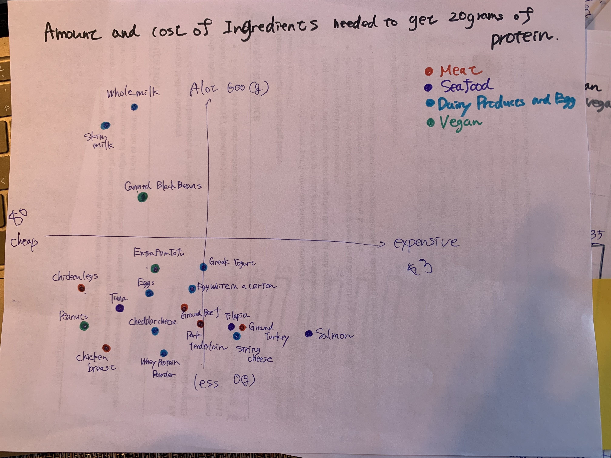

# Data Visualization of Protein Data

## Step1: Choose a data visualization
I decided to choose [this data visualization](https://data.world/makeovermonday/2023w8) for this project.
[Here](https://lifehacker.com/the-cheapest-ways-to-get-your-protein-right-now-1850001760) is the related article called "The Cheapest Ways to Get Your Protein Right Now".
I'm personally interested in this topic, so I chose it.

## Step2: Critique the data visualization
In this project, we used Stephen Few's Data Visualization Effectiveness Profile to complete a critique.

Below is the summary of my critique.

### Primary Audience
I think the main target audience should be people who care about their diet and try to eat an appropriate amount of protein without spending too much money.
Since there is calorie data in the chart, I think the author wanted to address the audience's concern, which is the calorie issue.In order to convey that information alongside the cost, I believe there is another effective way to do that.
After reading the article, another audience came to my mind, which was vegetarian people. Since this chart is not highlighted, it could be interesting if I could highlight some data to convey a story using the data for the specific target audience.

### Evaluation from 7 perspectives
・Usefulness: 8 < 1:useless - 10:very useful>
 -> It is helpful for people who care about their diets and try to eat an appropriate amount of protein without spending a lot of money

・Completeness: 1 <1:No relevant data - 10:All relevant data>
 -> The calories are not relevant and have confusing values
 -> Images of food are not necessary and some of them are hard to understand intuitively

・Perceptibility: 2 <1:Unclear and difficult - 10:Clear and easy>
 -> The bar chart itself is clear, but the values on each bar are confusing since they are irrelevant to the visualization

・Truthfulness: 2 <1:Inaccurate and / or invalid - 10:accurate and /or valid>
 -> The chart includes the data that the title tells but also contains calorie data, which is not mentioned in the title

・Intuitiveness: 3 <1:Unfamiliar, difficult to understand - 10:Familiar, easy to understand>
 -> Since the title is clear, the message is easy to understand, but the chart contains additional/irrelevant information, it’s not intuitive to understand

・Aesthetics: 4 <1:Ugly - 10:Beautiful>
 -> The X-axis labels are not user-friendly since they’re placed diagonally
 -> The images are not beautiful
 -> It’s not clear the reasons for bold and not bold text

・Engagement: 8 <1:Distracts from data - 10:Draws one into the data>
 -> The calorie data is interesting, which makes the audience start conversations about it. However, it requires a different chart or approach to represent all data

### Thoughts

- My eyes were drawn to the images when I saw this chart since they stood out. It helped me to understand what kind of food is listed in this chart, but from the aesthetic aspect, I felt those images were not beautiful because their tone and manner are different from other elements in the chart and those images were not the main message.
- I think the bar chart itself works very well since this chart wants to tell the comparison of the amount of protein of 10 ingredients. However, the values in each bar (calories) are irrelevant and very confusing. When I saw the calorie data, my brain thought the values were related to the bar’s height. However, they are not relevant to the current key message, just additional information.
- Regarding the images, some of them such as protein bar, cottage cheese, and Yogurt are not very helpful since the protein bar looks like pasta and cottage cheese and yogurt are similar, which forced me to look at the X-axis labels.
- Labels on the X-axis are not user-friendly as they are placed diagonally. Also, I wasn’t familiar with the WPI, so I needed to google what it is or I needed to look through the article to understand what WPI stands for.
- After reading the article and observing the chart, I was curious about why they used different amounts of protein( 20g vs 30g), and I’d like to know about the reason.
- The chart used bold text and normal text, but I wasn’t sure how the author used them differently. I don’t think calories are necessarily bold at least since they’re additional information.
- I think the title and short description work very well together. They convey a key message very concisely.

## Step3 & 4 - Round1 -: Sketch and Test solution
Based on the critique, I sketched two charts.
While the First one shows the comparison of each ingredient, the second one emphasizes the peanuts.

chart #1

chart #2

Below is the feedback I got.

Feedback: chart #1
- _The categories work well_, 20s/student
- _The light blue and green look similar for some reasons, I wish you used more distinguishable colors_, 20s/office worker
- _I understand the cost, but I'm curious about how much I need to eat to get 20 grams of protein_, 20s/office worker

Feedback: chart #2
- _Personally, I'm not really surprised by the fact that peanuts have a lot of protein. I would rather know the comparison of each ingredient_, 20s/student
- _When I saw the bar chart, less is worse, but it's not_, 20s/office worker

## Step3 & 4 - Round2 -: Sketch and Test solution
Considering the feedback from round 1, I created two different charts again.
In addition to outside of the class, I got a chance to receive feedback in class.

chart #3

Regarding chart #3, I took into account the feedback about the amount of each ingredient.
Considering the groceries cost, I thought $10 would be appropriate. And I believe that $10 would give the audience a sense of how much amount of ingredients each bar shows.

chart #4

This chart shows the relationship between cost and amount to get 20 grams of protein.
I converted each ingredient's unit into grams so that I could plot all of them on the same chart.

Feedback: chart #3
- _It's easy to understand. Good_, 20s/office worker
- _Light blue and dark blue are hard to distinguish for blue-colored blinded people. I would suggest to use different type of colors_, 20s/student
- _I needed to move my eyes from left to right to check the categories. I wish you could incorporate category information in the chart_, 30s/student
- _Overall, the bar chart is more simple and intuitive, so I prefer this rather than the other one_, 30s/student

Feedback: chart #4
- _There are too many labels, so I think some people would stop looking at this chart_, 20s/student
- _The labels are too close to each other, which makes it harder to read them_, 30s/student
- _The scale of the X-axis and Y-axis is very different. It could be misleading_, 20s/office worker
-  _I like this chart since I get a lot of interesting information from it, but at the same time it takes time to figure it out_, 20s/office worker

## Step5: Build my solution

Since I got positive feedback about chart #3, I decided to elaborate on my solution based on it.
In order to minimize the user's eye movement, I incorporated categories in the chart.

