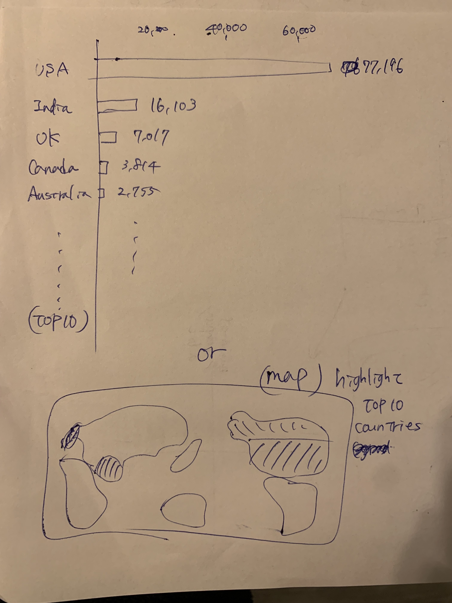
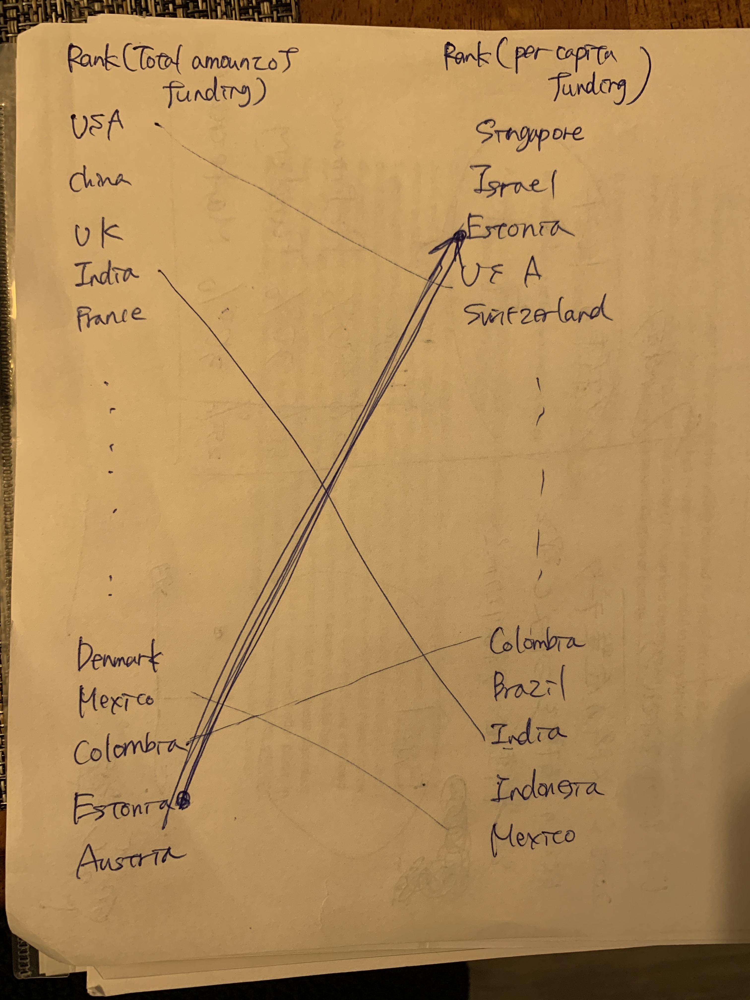
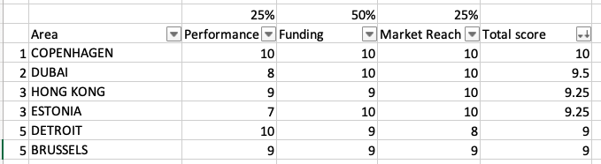

# Final Project: Part 1

## Theme
- The emerging market for startups.
- Since the number of startups has been increasing and getting popular, I would like to talk about the coming and prospective market for startups.
- The title might be "Estonia is the growing market for startups" or "Countries that you should know for your future investment and job opportunities".

## Target Audience
- Angel investors
- Job seekers

## Story & Data & Sketch
1. What is a startup?: Explain a definition of startups

2. 5,799 startups were created in the US in 2022 and over 72,500 startups are in the US now. [source](https://www.zippia.com/answers/how-many-startups-were-created-in-2022/)

3. Obviously, the US has the largest number of startups in the world and VC invested about $245B, which is the largest amount of money, in the US. [source: number of startups](https://www.startupranking.com/countries), [source:amount of investment](https://dealroom.co/guides/global)

4. However, there is an interesting fact. If we look at the per capita funding, the ranking looks very different. Estonia grabs our attention. One takeaway from the information is that India and China, two of the largest global venture capital markets, score rather low on the per capita metric. This indicates that while they have flourishing startup economies, they don’t encompass a large share of the population. [source: funding](https://news.crunchbase.com/startups/countries-most-startup-investment/), [source: population](https://worldpopulationreview.com/countries)

5. Also, there is an evaluation score for each country's market, and Estonia ranks 3 in the emerging ranking. [source](https://startupgenome.com/reports/gser2023) *I used some of the data from this report and calculated them to get a score for each country.

6. So, why does Estonia attract many prospective startups?

7. That's because Estonia introduced a Startup Visa program in 2017. The program has been aimed at enabling startup founders to relocate their businesses to Estonia and benefit from the full range of perks of the first country in the world to offer e-Residency and e-voting. Additionally, the visa scheme facilitates the process of hiring talent from outside the European Union in Estonian startups. [source](https://workinestonia.com/estonia-leads-europe-in-startups-unicorns-and-investments-per-capita/#:~:text=Estonia%20has%20the%20most%20startups,European%20country%20for%20tech%20startups.)

8. You should check out Estonia's startup communities from [here](https://ecosystem.startupestonia.ee/custom.startups/f/all_slug_locations/anyof_estonia/data_type/anyof_Verified/launch_year_min/anyof_2012?)

## Method and medium
- I'm planning to use Shorthand to make my data visualization.
- I would like to incorporate some tips and techniques written in the textbook such as creating tension.

[<< Go Back to Main Page](https://meeeeeeeei28.github.io/Mei-Portfolio/)

